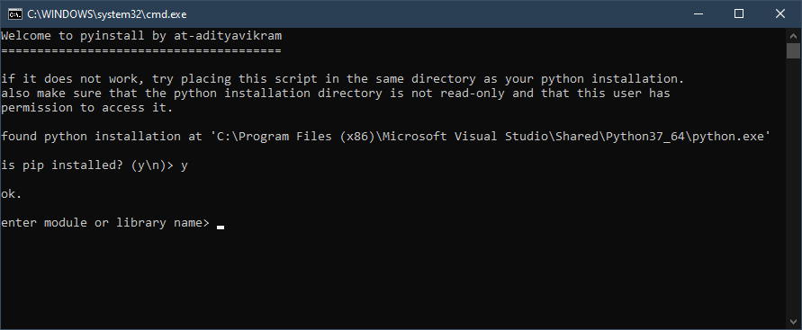

# pyinstall
Install python packages (or pip itself) easily (even with disabled cmd). 
Make sure the folder of your python installation is not read-only.  

  
follow guided prompts to 
<ol type="a">
  <li>install pip if you don't have it
     or 
  <li>install any module
</ol>
